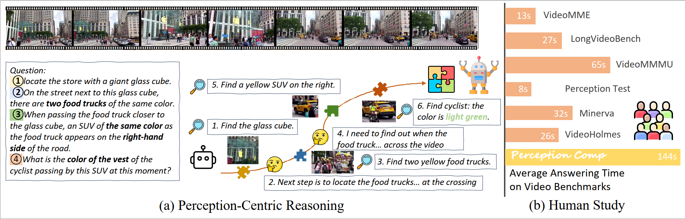
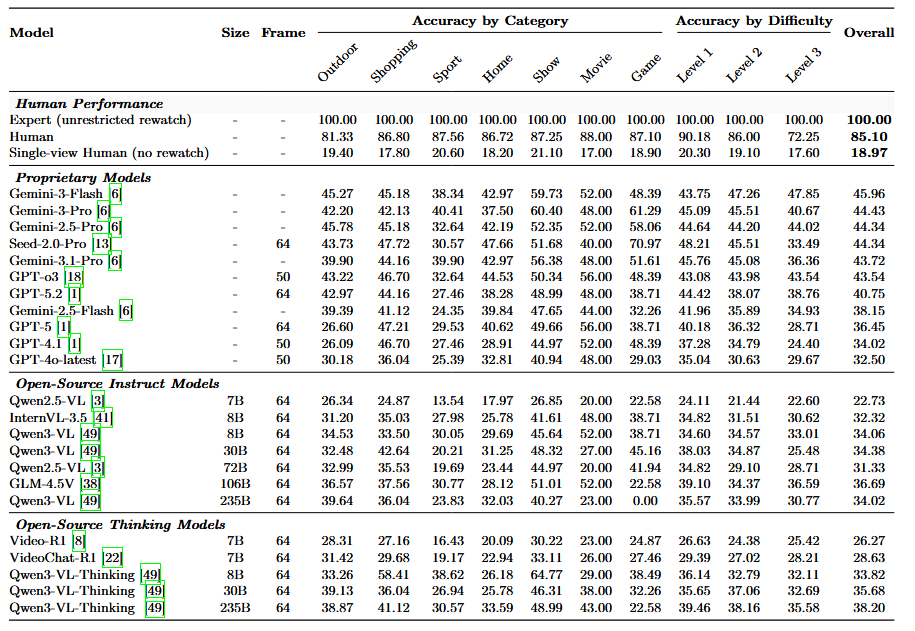

<div align="center">
  <h1><span class="pc-gradient-name">PerceptionComp</span>: A Video Benchmark for Complex Perception-Centric Reasoning</h1>
  <p>
    <a href="https://huggingface.co/datasets/hrinnnn/PerceptionComp">
      
    </a>
    <a href="https://arxiv.org/abs/2603.26653">
      
    </a>
    <a href="https://shaoxuanli.github.io/PerceptionComp.github.io/">
      
    </a>
  </p>
</div>

## Introduction

<p align="center">
  
</p>

**PerceptionComp** is a benchmark for complex perception-centric video reasoning. It targets questions that cannot be solved from a single frame, a single moment, or a short caption: models must revisit visually complex videos, gather evidence from temporally separated segments, and combine multiple perceptual constraints before answering.

## ✨ Highlights

- Complex perception-centric reasoning instead of caption-level shortcut solving.
- 1,114 manually annotated five-choice questions.
- Seven categories spanning outdoor tour, shopping, sport, variety show, home tour, game, and movie.
- Unified workflow for download, local video storage and evaluation.
- Extensible evaluation entry point that supports OpenAI-compatible APIs, Gemini, and custom model runners.

## 📦 Data Release

PerceptionComp is released in two parts:

1. GitHub repository:
   contains benchmark annotations, evaluation code, runner templates, analysis utilities, and documentation.
2. Hugging Face dataset:
   stores the benchmark videos referenced by `video_id`.

<!-- Current release structure:

- benchmark annotations:
  [1-1114.json](/Users/zhaozhixuan/Desktop/tsinghua_learning/大二暑/暑研/PerceptionComp/benchmark/annotations/1-1114.json)
- video host:
  <https://huggingface.co/datasets/hrinnnn/PerceptionComp/tree/main>
- local video target directory:
  [benchmark/videos](/Users/zhaozhixuan/Desktop/tsinghua_learning/大二暑/暑研/PerceptionComp/benchmark/videos) -->

## 📊 Main Results

<!-- This README only shows the overall scores. More detailed per-category and per-difficulty analysis can live in the paper, supplementary materials, or a separate leaderboard page. -->

<p align="center">
  
</p>

<!-- 
### Human Performance

| Model | Overall |
| --- | ---: |
| Expert (unrestricted rewatch) | 100.00 |
| Human | 85.10 |
| Single-view Human (no rewatch) | 18.97 |

### Proprietary Models

| Model | Overall |
| --- | ---: |
| Gemini-3-Flash | 45.96 |
| Gemini-3-Pro | 44.43 |
| Gemini-2.5-Pro | 44.34 |
| Seed-2.0-Pro | 44.34 |
| GPT-o3 | 43.54 |
| GPT-5.2 | 40.75 |
| Gemini-2.5-Flash | 38.15 |
| GPT-5 | 36.45 |
| GPT-4.1 | 34.02 |
| GPT-4o-latest | 32.50 |

### Open-Source Instruct Models

| Model | Overall |
| --- | ---: |
| Qwen2.5-VL 7B | 22.73 |
| InternVL-3.5 8B | 32.32 |
| Qwen3-VL 8B | 34.06 |
| Qwen3-VL 30B | 34.38 |
| Qwen2.5-VL 72B | 31.33 |
| GLM-4.5V 106B | 36.69 |
| Qwen3-VL 235B | 34.02 |

### Open-Source Thinking Models

| Model | Overall |
| --- | ---: |
| Video-R1 7B | 26.27 |
| VideoChat-R1 7B | 28.63 |
| Qwen3-VL-Thinking 8B | 33.82 |
| Qwen3-VL-Thinking 30B | 35.68 |
| Qwen3-VL-Thinking 235B | 38.20 | -->

## 🚀 Quick Start

<!-- The expected workflow is:

1. Clone the repository.
2. Install dependencies.
3. Download the benchmark videos from Hugging Face.
4. Run evaluation with a built-in backend or your own model adapter.
5. Read the generated result files from `evaluate/results/`. -->

##### Step 1. Clone the Repository

```bash
git clone https://github.com/hrinnnn/PerceptionComp.git
cd PerceptionComp
```

##### Step 2. Install Dependencies

```bash
pip install -r requirements.txt
```

##### Step 3. Download the Benchmark Videos

Download the benchmark videos from the Hugging Face dataset using the official helper script:

```bash
python scripts/download_data.py --repo-id hrinnnn/PerceptionComp
```

If the Hugging Face dataset requires authentication:

```bash
python scripts/download_data.py \
  --repo-id hrinnnn/PerceptionComp \
  --hf-token YOUR_HF_TOKEN
```

This script downloads the videos from the Hugging Face `data/` directory, flattens the downloaded snapshot into the local layout expected by the evaluator, and validates the result against the official annotation file.

After the script finishes successfully, your local layout is ready for evaluation:

```text
benchmark/
  videos/
    <video_id>.mp4
```

##### Step 4. Run Evaluation with a Built-in Backend

PerceptionComp currently supports three evaluation modes:

- `api`: OpenAI-compatible APIs
- `gemini`: Gemini video-upload workflow
- `custom`: your own model runner

###### Option A. OpenAI-Compatible API

Use this for GPT-style APIs, Qwen API deployments, GLM-compatible endpoints, Doubao-style endpoints, and similar services.

```bash
python evaluate/evaluate.py \
  --model YOUR_MODEL_NAME \
  --provider api \
  --api-key YOUR_API_KEY \
  --base-url YOUR_BASE_URL \
  --video-dir benchmark/videos
```

Optional arguments:

- `--output-dir`: change where results are written
- `--frames`: control the number of sampled frames
- `--proxy`: pass a proxy for API calls

###### Option B. Gemini

```bash
python evaluate/evaluate.py \
  --model YOUR_GEMINI_MODEL_NAME \
  --provider gemini \
  --api-key YOUR_GEMINI_API_KEY \
  --video-dir benchmark/videos
```

Optional arguments:

- `--force-thinking`: retry when `<think>` tags are missing
- `--output-dir`: change where results are written

##### Step 5. Check the Outputs

Evaluation outputs are written to:

```text
evaluate/results/Results-<model>.json
evaluate/results/Results-<model>.csv
```

The JSON file stores per-question predictions and raw responses. The CSV file stores aggregated scores.

## 🛠️ Evaluate Your Own Model

<!-- A public benchmark should support evaluation on external models. This is standard practice for benchmark repositories, but different projects implement it differently:

- LongVideoBench provides a dataset loader and encourages integration into a general evaluation framework.
- Video-Holmes exposes model-specific hooks inside the evaluation pipeline and documents where to modify the model code.

PerceptionComp follows the same general principle:

- the benchmark owns the dataset, prompt construction, answer parsing, metrics, and output format;
- your model adapter only needs to turn `(video, prompt)` into a raw text response.

That separation is what makes a benchmark portable across proprietary APIs, local checkpoints, internal inference servers, and future evaluation frameworks. Source: [LongVideoBench README](https://github.com/longvideobench/LongVideoBench), [Video-Holmes README](https://github.com/TencentARC/Video-Holmes). --> 

If your model is local, implement a custom runner. You can follow these steps: 

###### Step 1. Copy the Template

```bash
cp evaluate/tools/runners/custom_template.py evaluate/tools/runners/my_model.py
```

###### Step 2. Implement the Model Hook

Open `evaluate/tools/runners/my_model.py` and replace `run_your_model(...)` with your own inference logic.

Your function should take:

- `video_path`
- `prompt`
- `model_name`
- `custom_config` (optional)

and return:

- a raw string response from the model

The simplest recommended output format is:

```text
Answer: A
```

or, if your model supports reasoning traces:

```text
<think>
your reasoning here
</think>
<answer>
A
</answer>
```

###### Step 3. Run Evaluation with the Custom Runner

```bash
python evaluate/evaluate.py \
  --model YOUR_MODEL_NAME \
  --provider custom \
  --custom-runner evaluate/tools/runners/my_model.py \
  --video-dir benchmark/videos
```

If your runner needs an extra config file:

```bash
python evaluate/evaluate.py \
  --model YOUR_MODEL_NAME \
  --provider custom \
  --custom-runner evaluate/tools/runners/my_model.py \
  --custom-config path/to/your_config.json \
  --video-dir benchmark/videos
```

###### Step 4. Keep the Benchmark Protocol Fixed

When adapting your own model, do not modify:

- the annotation format,
- the question prompt structure,
- the answer parsing logic,
- the metric computation,
- the output schema.

Only change the model-side inference path. That is what keeps your results comparable to other models.

<!-- For a more explicit implementation guide, see [bring_your_own_model.md](/Users/zhaozhixuan/Desktop/tsinghua_learning/大二暑/暑研/PerceptionComp/docs/bring_your_own_model.md). -->

The default custom runner template is now a near-runnable local `transformers` scaffold. If your model follows a Hugging Face VLM workflow, you can often start from the template directly instead of writing a runner from scratch.

<!-- ## Supported Models

The unified entry point currently supports two built-in backend families plus a custom adapter path:

| Backend | Usage | Notes |
| --- | --- | --- |
| OpenAI-compatible API | `--provider api` | Works for GPT-style APIs, Qwen API deployments, GLM-compatible endpoints, Doubao-style endpoints, and other OpenAI-compatible services. |
| Gemini | `--provider gemini` | Uses the Gemini video upload workflow for Gemini-family models. |
| Custom runner | `--provider custom` | Loads a Python file that implements your own inference logic. | -->

<!-- Models already represented in the repository's archived results include:

- GPT-4.1, GPT-4o, GPT-5, GPT-5.2, GPT-o3
- Gemini-2.5-Flash, Gemini-2.5-Pro, Gemini-3-Pro, Gemini-3.1-Pro
- Qwen2.5-VL-7B, Qwen2.5-VL-72B
- Qwen3-VL-235B-A22B-Instruct, Qwen3-VL-235B-A22B-Thinking
- Qwen3-VL-30B-A3B-Instruct, Qwen3-VL-30B-A3B-Thinking
- GLM-4.5V
- Doubao-Seed variants -->
<!-- 
## 📌 Benchmark Snapshot

##### Benchmark Overview:

| Item | Value |
| --- | --- |
| Question Number | 1,114 |
| Video Number | 273 |
| Question Format | 5-choice multiple choice |
| Categories | 7 |

##### Question Categories:

| Category | Questions |
| --- | --- |
| outdoor tour | 391 |
| shopping | 197 |
| sport | 193 |
| variety show | 149 |
| home tour | 128 |
| game | 31 |
| movie | 25 |

##### Annotation Format

Each item in the official benchmark file is a five-choice question tied to a `video_id`.

Core fields:

- `key`: question id
- `video_id`: video name without `.mp4`
- `question`: question text
- `answer_choice_0` to `answer_choice_4`: the five answer options
- `answer_id`: zero-based correct option index
- `answer`: text form of the correct answer
- `category`: semantic category
- `difficulty`: difficulty label -->

## 📚 Citation

If you use PerceptionComp, please cite the corresponding paper once the public version is finalized.

```bibtex
@misc{perceptioncomp2026,
  title={PerceptionComp: A Video Benchmark for Complex Perception-Centric Reasoning},
  year={2026}
}
```
